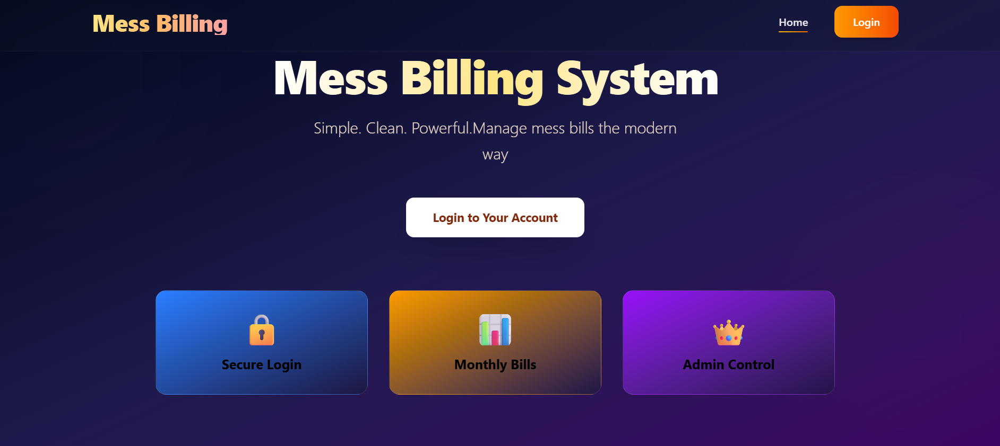
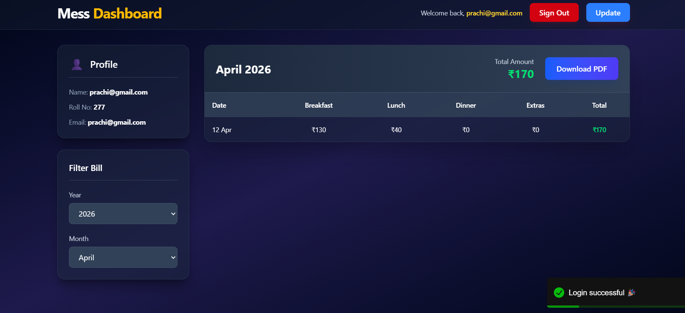
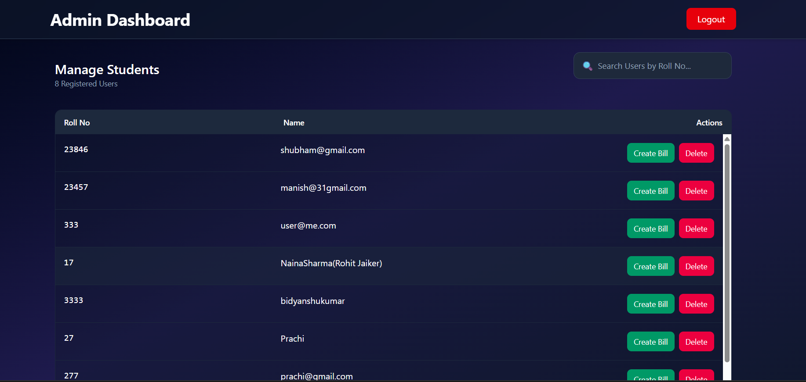
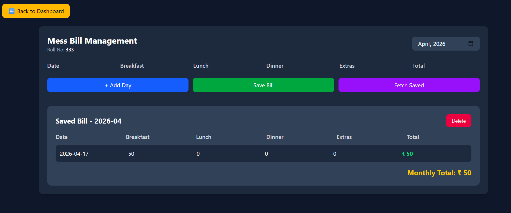

# 🍽️ Mess Billing System

A web-based application to simplify and automate the mess billing process.
This project helps in tracking daily meals and generating accurate monthly bills without manual calculation.

---

## 🚀 About the Project

In many hostels and PGs, mess billing is still done manually, which often leads to calculation errors and confusion.

To solve this problem, I built this system where:

* Daily meals are recorded
* Data is stored in the database
* Monthly bills are generated automatically

This makes the process faster, transparent, and error-free.

---

## ✨ Features

* User registration and login system
* Daily meal entry (Breakfast, Lunch, Dinner)
* Automatic monthly bill calculation
* PDF bill generation
* Email sending of bills
* Admin panel to manage users and data
* Real-time updates using Socket.io

---

## 🛠️ Tech Stack

**Frontend:**
HTML, CSS, JavaScript / React

**Backend:**
Node.js, Express.js

**Database:**
MongoDB (Mongoose)

**Other Tools & Libraries:**

* bcryptjs (for password hashing)
* jsonwebtoken (for authentication)
* node-cron (for scheduled tasks)
* nodemailer (for sending emails)
* pdfkit (for generating bills in PDF)
* socket.io (for real-time updates)

---

## ⚙️ How It Works

1. User registers and logs in
2. Meals are recorded daily
3. Each meal has a fixed price
4. At the end of the month:

   * Total meals are calculated
   * Bill is generated automatically
   * PDF is created
   * Bill is sent via email

---

## 📂 Setup Instructions

### Clone the repository

```bash
git clone 
cd mess-billing-system
```

### Install dependencies

```bash
npm install
```

### Run the server

```bash
npm run dev
```

---

## 📸 Screenshots

### Main Dashboard



### User Dashboard



### Admin Panel



### Billing Dashboard



---

## 🔐 Environment Variables

Create a `.env` file in root folder:

```
MONGO_URI=your_mongodb_connection_string
JWT_SECRET=your_secret_key
EMAIL_USER=your_email
EMAIL_PASS=your_email_password
PORT=5000
```

---

## 🧠 What I Learned

* How to design REST APIs
* Implement authentication using JWT
* Automate tasks using cron jobs
* Generate PDFs dynamically
* Integrate email services in backend
* Handle real-time updates using sockets

---

## 🔮 Future Scope

* Add online payment integration
* Build mobile-friendly UI
* Add analytics dashboard
* Improve UI/UX

---

## 👨‍💻 Author

Rohit Kumar

---
